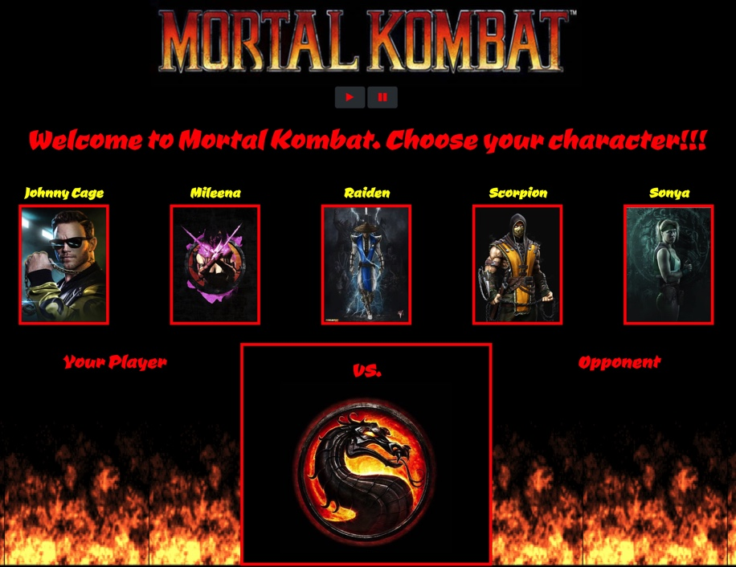
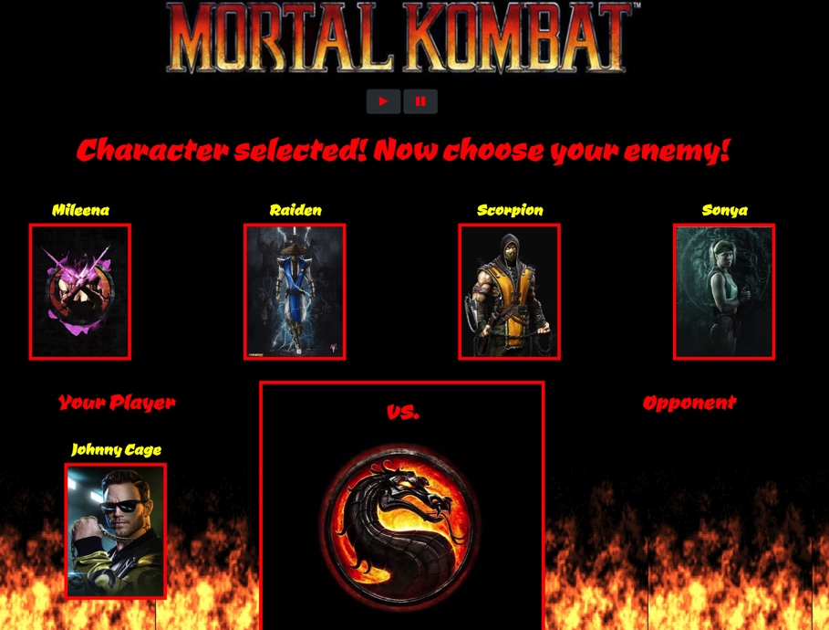
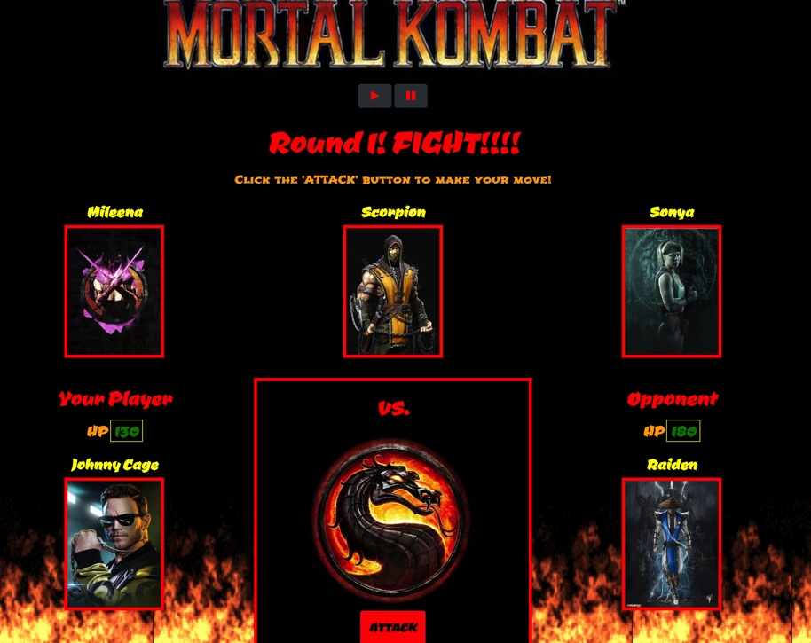
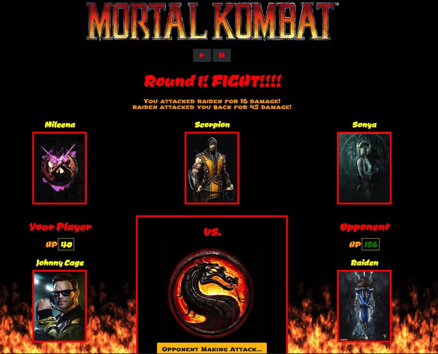
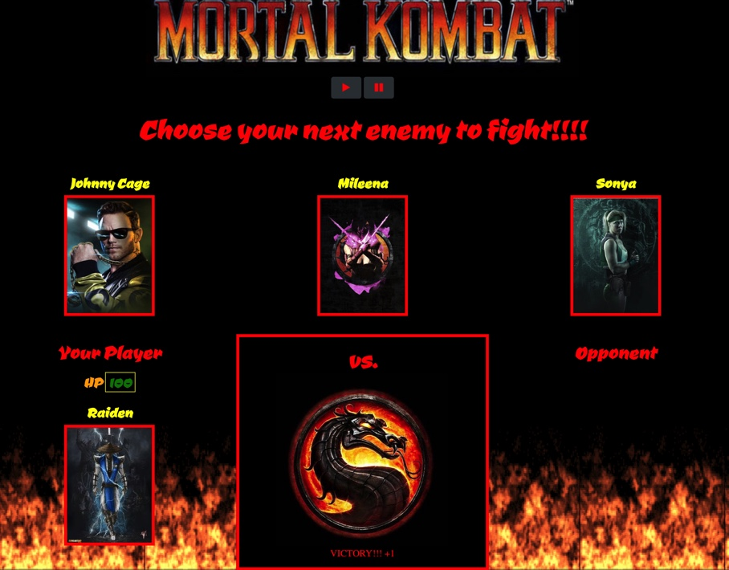
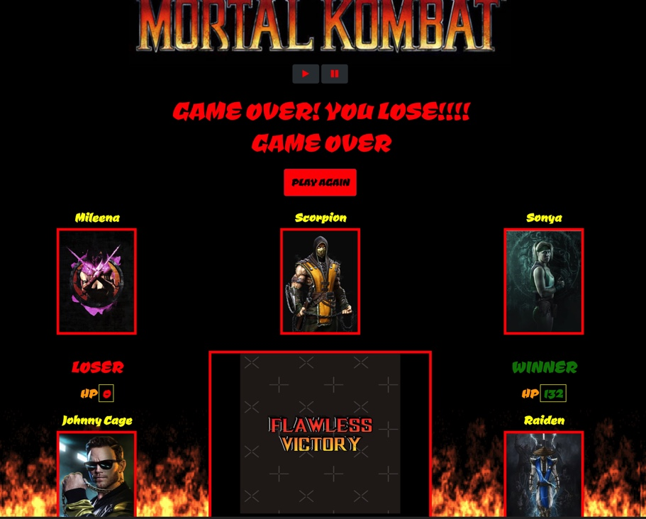

# Mortal Kombat 

Demo a live version of this game application here: [https://mkchung8.github.io/mortal-kombat/]

'Mortal Kombat' is an interactive game created for web browsers. The purpose of this web application was to use the jQuery library to dynamically update HTML pages. 

## Getting Started 

To use this game application, click on the link to the live demo listed above or clone the repository onto your machine. You can then navigate to the root directory to launch the application on your machine. 

When the game starts, the player will choose a character by clicking on the fighter's picture. The player will fight as that character for the rest of the game.

The player chooses an opponent by clicking on an enemy's picture. 

Once the player selects an opponent, that enemy is moved to a defender area. 

The player will now be able to click the "ATTACK" button. Whenever the player clicks the "ATTACK" button, their character damages the defender. The opponent will lose health points which are displayed on top of the character's screen. THe opponent will then instantly counter the attack, causing the player's character to lose health points. 

The player will keep hitting the attack button in an effort to defeat their opponent. 

When the player has defeated their current opponent, they must select their next opponent. 

The player will continue to play fight rounds until every opponent has been eliminated. 

The player wins the game by defeating all enemy characters. The player loses the game if their player's HP falls to zero or below. 

## Technologies Used 
* HTML/CSS
* JavaScript
* Bootstrap 
* jQuery

#### Code Created and Maintained by: 
Miyoung K. Chung 
mkchung.8@gmail.com
https://www.miyoungchung.com/
https://www.linkedin.com/in/mkchung8/
